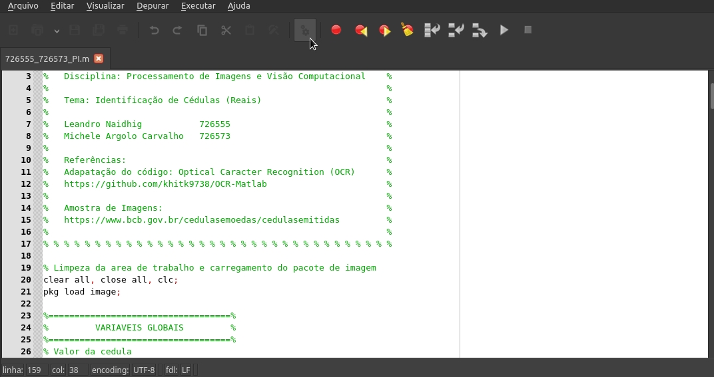
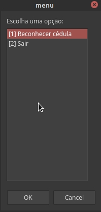
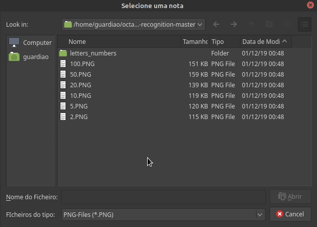
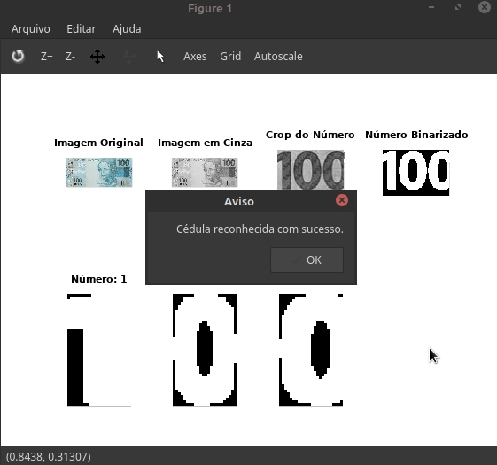
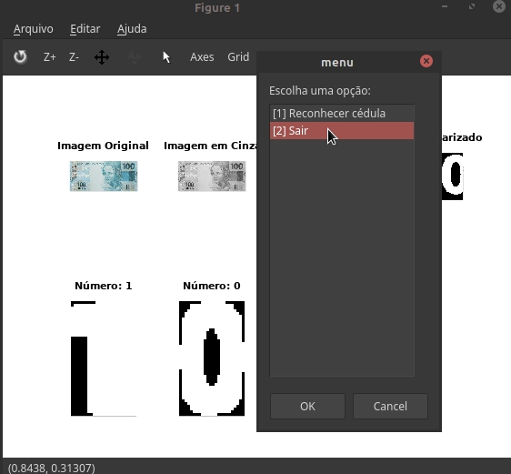

## Processamento de Imagens

Bacharelado em Ciência da Computação

Universidade Federal de São Carlos

Campus Sorocaba

Trabalho Prático da disciplina de Laboratório de Compiladores

----

## Tutorial

1 - Execução:

Ao clicar no ícone de execução (engrenagem) do octave, o programa será exexutado.

2 - Menu:

É exibido as opções do menu, em que o usuário pode solicitar o carregamento da imagem de uma cédula para reconhecimento ou finalizar a execução do programa. O usuário consegue realizar quanto reconhecimentos desejar.

3 - Seleção da cédula:

Caso o usuário optar pelo reconhecimento de uma cédula, a pasta onde localiza-se o código principal é exibida e o usuário pode escolher um dos arquivos .png para reconhecimento.

4 - Exibição do pré processamento:

Após o reconhecimento, é exibido os pré processamentos na imagem para reconhecimento do número, como a imagem em escala de cinza, imagem binarizada invertida e os numeros reconhecidos isoladamente.

5 - Sair:

O menu é exibido novamente. Se o usuário optar por reconhecer uma nova cédula, voltamos para o passo 3. Se o usuário optar por Sair, o programa é finalizado.

6 - Resultado final:

Na finalização do programa, exibimos a quantidade de cada cédula reconhecida e o valor total das cédulas.
